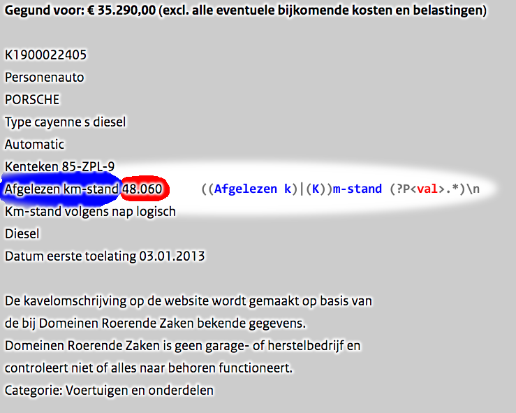

# Saturday Data science

## TL;DR

- Monthly police auction results.
- So far 2+ years of auction 5000+ results with 3000+ cars.
- Aside from make and model, engine specification, color, and more is available, amounting to 100+ features.
- Item features can be used to predict pricing.
- Images can be used for classification.

- - - -

Here you can follow what I am doing on a Saturday (and sometimes [other days](.,/../graphs/commit-activity) too).  

A project I am working on involves **Police auctions** held once a month by the Dutch authorities: [Dienst Domeinen Roerende Zaken](https://www.domeinenrz.nl/) (or _DRZ_). The results of the auction [^1] are published. 
Initially I set out to get a bidding advantage in a future auction by using prior auction results. In a way I was setting myself up for a prediction modeling project!  

What makes this project interesting is that I did the full pipeline from data engineering to analysis: Scraping data > Cleaning up > Combining data sets > Modeling.  

Although the published auction results are relatively clean, there is enough "dirt" to make it challenging for data cleaning. 

  
_Screenshot of website_

I started working on this in 2014, but I've been systematically been collecting results for about two years now. All sorts of lots (goods) are auctioned off: Cars, trucks, motorcycles and trailers. I've been focussing on getting the results on cars cleaned.

To interpret the auction results, I realize it helps to know a little Dutch. For instance the date format is "day first": dd-mm-yyyy and the decimal separator is `,` and the thousand separator is `.`. One thousand euros and forty two cents is formatted as `EUR 1.000,42`.  
I've tried to translate the results into meaningful field names. Here below I've added a glossary, but if something remains unclear you can always raise an issue.

## Step 1: Scraping the results [(notebook)](./code/scrape-drz-auction-results.ipynb)

Initially results were published on a downloadable [.pdf file](./assets/201410-catalogusdrz.pdf). 
In the past I've selected the text manually and copied it to a text file, which I parsed with workable, but not so pretty _Matlab/Octave_ code.
Those old routines have since been archived.  

The way the results are published have changed since and they became available on a website. I've decided to scrape these results with home-brew _python_ routines that use _pandas_ and run from _Jupyter notebooks_. Initially I used clunky solutions like `str.index` to find patterns in the text, but recently I started using [regular expressions](https://en.wikipedia.org/wiki/Regular_expression) (regex). This is more powerful and maintains a clean workflow. The regex patterns are stored in .csv files: [./code/regex-patterns](./code/regex-patterns).

  
_Screenshot of an auction result. This example lot was sold in February 2019 for EUR 35,290.00 (about $40.000)_

  
_Example of how a *regex* pattern is used in parsing text. In this case the odometer value follows the text `Km-stand`, which might also be in lower case._

The drz website is subject to change once in a while [^2], and sometimes it feels I am aiming at a moving target, but this keeps it challenging. 

### Known issues
- Occasionally lots are a combination of multiple items. Currently only the first item will be handled, however I also store the raw text for future provisioning.

## Step 2: adding extra information [(notebook)](./code/add-rdw-info-to-drz.ipynb)

Most lots are vehicles with a registration. The Dutch equivalent to the DMV know as [Dienst Wegverkeer](https://www.rdw.nl/information-in-english) (or _RDW_) provides an API service where registration can be queried. This gives additional information about vehicles that is not in the auction results such as engine capacity.

The RDW does a pretty good job maintaining this open data dataset. Definitions are [well documented](https://opendata.rdw.nl/Voertuigen/Open-Data-RDW-Gekentekende_voertuigen/m9d7-ebf2). They have a [google forum](https://groups.google.com/forum/#!topic/voertuigen-open-data/rnwGKL-HQ8Y) where updates are communicated.

## Step 3: EDA [(notebook)](./code/explore-auction-results.ipynb)

With the scraped and results I can do some basic **E**xploratory **D**ata **A**nalysis.

## Step 4: aggregate into one dataset [(notebook)](./code/aggregate-all-auctions.ipynb)

In this step all auction results are merged into one dataset. All cars are selected and saved to disk in `.pkl` format.

The last 10 rows of the dataset created in Februari 2019 look like here below. Some fields (e.g. raw text) have been replaced by a placeholder text to reduce the size of the table.

LotNr|Price|Title|LotCat|LotType|ItemBrand|ItemType|Mfdate|Mfyear|APKdate|benzine|diesel|lpg|hybrid|electric|automatic|cabriolet|OdoKM|OdoMLS|OpH|NAP|Reg|ForeignReg|import|jfc|maybe_reg|no_cvo|no_igk|no_inireg|no_key|no_nlreg193|no_nlreg194|no_odo|no_orireg|no_rdw|no_reg|no_regneeded|no_road|rdw150|rhd|taxi|BTW|disclaim1|disclaim2|disclaim3|disclaim4|Draw|SupInfo|Note|Raw_text|rdwinfo|Images|N_images|Source|early_reg|locked|wo_frame|used_parts|disclaim_cr6|import22_btw21|import27_btw21|OdoKM_num|disclaim12|crewcab|carwrap|no_vin
-----|-----|-----|-----|-----|-----|-----|-----|-----|-----|-----|-----|-----|-----|-----|-----|-----|-----|-----|-----|-----|-----|-----|-----|-----|-----|-----|-----|-----|-----|-----|-----|-----|-----|-----|-----|-----|-----|-----|-----|-----|-----|-----|-----|-----|-----|-----|-----|-----|-----|-----|-----|-----|-----|-----|-----|-----|-----|-----|-----|-----|-----|-----|-----|-----|-----
K1900027254|1290.0|Kavel K1900027254|Voertuigen en onderdelen |Personenauto|VOLVO|v50|13.10.2004|||False|True|False|False|False|False|False|191.969|||||Lets|False|False|False|True|False|False|False|0.0|True|False|False|False|True|False|False|True|False|False||True|True|False|0.0|False|.. suplm. info. ..|False|.. raw text ..|.. rdw info ..|['http://www.domeinenrz.nl/ufc/static/1548759406/thumb/domeinenrz_sites/b8511330ea7826076e8e80a83336a6b0/1024/768/image.jpg', 'http://www.domeinenrz.nl/ufc/static/1548759400/thumb/domeinenrz_sites/55046cc6a505ff054d5b2a9600ffee20/1024/768/image.jpg', 'http://www.domeinenrz.nl/ufc/static/1548759406/thumb/domeinenrz_sites/b41855ea6250fe0acdbde18e932d3ed2/1024/768/image.jpg']|3.0|http://www.domeinenrz.nl/catalogus/verkoop_bij_inschrijving_2019-0002_februari?=&meerfotos=K1900027254&veilingen=2019-0002|False|False|False||False|||||False|False|False
K1900027255|0.0|Kavel K1900027255|Voertuigen en onderdelen |Personenauto|SAAB|417|31.03.2008|||False|True|False|False|False|False|False||159.718||||Brits|False|False|False|True|False|False|False|0.0|True|False|False|False|True|False|False|True|True|False||True|True|False|0.0|False|.. suplm. info. ..|False|.. raw text ..|.. rdw info ..|['http://www.domeinenrz.nl/ufc/static/1548759397/thumb/domeinenrz_sites/09eb860e81b3715161821d6304079619/1024/768/image.jpg', 'http://www.domeinenrz.nl/ufc/static/1548759409/thumb/domeinenrz_sites/f2801e7b228971994110fadfae2cbd0d/1024/768/image.jpg', 'http://www.domeinenrz.nl/ufc/static/1548759408/thumb/domeinenrz_sites/e0b69af72a01902bc9ff4ba8828646f4/1024/768/image.jpg']|3.0|http://www.domeinenrz.nl/catalogus/verkoop_bij_inschrijving_2019-0002_februari?=&meerfotos=K1900027255&veilingen=2019-0002|False|False|False||False|||||False|False|False
K1900027256|0.0|Kavel K1900027256|Voertuigen en onderdelen |Personenauto|VOLVO|v70; d5|19.05.2004|||False|True|False|False|False|True|False|398.248|||onlogisch|64-PF-HH||False|False|False|False|False|False|False|0.0|False|False|False|False|False|False|False|False|False|False||True|True|False|0.0|False|.. suplm. info. ..|False|.. raw text ..|.. rdw info ..|['http://www.domeinenrz.nl/ufc/static/1548759406/thumb/domeinenrz_sites/c26968ba1d63beb4a8366fa88af6e40b/1024/768/image.jpg', 'http://www.domeinenrz.nl/ufc/static/1548759396/thumb/domeinenrz_sites/020f2d9e73a5846837605b5f4423eb5f/1024/768/image.jpg', 'http://www.domeinenrz.nl/ufc/static/1548759407/thumb/domeinenrz_sites/cd91f6e4e730b95370d027a779980576/1024/768/image.jpg']|3.0|http://www.domeinenrz.nl/catalogus/verkoop_bij_inschrijving_2019-0002_februari?=&meerfotos=K1900027256&veilingen=2019-0002|False|False|False||False|||||False|False|False
K1900027257|190.0|Kavel K1900027257|Voertuigen en onderdelen |Personenauto|MAZDA|6|30.06.2005|||False|True|False|False|False|False|False|182.287|||||Duits|False|False|False|True|False|False|True|0.0|True|False|False|False|True|False|False|True|False|False||True|True|False|0.0|False|.. suplm. info. ..|False|.. raw text ..|.. rdw info ..|['http://www.domeinenrz.nl/ufc/static/1548759401/thumb/domeinenrz_sites/5b26d84b2232f15ef0a06afb534cb35d/1024/768/image.jpg', 'http://www.domeinenrz.nl/ufc/static/1548759398/thumb/domeinenrz_sites/29aeffcd99368399dbe4346e51a350e0/1024/768/image.jpg', 'http://www.domeinenrz.nl/ufc/static/1548759401/thumb/domeinenrz_sites/5985a4a1b6613dcd1f0b2cc227f4033d/1024/768/image.jpg']|3.0|http://www.domeinenrz.nl/catalogus/verkoop_bij_inschrijving_2019-0002_februari?=&meerfotos=K1900027257&veilingen=2019-0002|False|False|False||False|||||False|False|False
K1900027258|1100.0|Kavel K1900027258|Voertuigen en onderdelen |Personenauto|VOLVO|v50; t5|05.01.2005|||True|False|False|False|False|False|False|358.460|||logisch|48-PX-TF||False|False|False|False|False|False|False|0.0|False|False|False|False|False|False|False|False|False|False||True|True|False|0.0|False|.. suplm. info. ..|False|.. raw text ..|.. rdw info ..|['http://www.domeinenrz.nl/ufc/static/1548759400/thumb/domeinenrz_sites/53f9f2bf471a26f4dddc2fabaecaed5b/1024/768/image.jpg', 'http://www.domeinenrz.nl/ufc/static/1548759409/thumb/domeinenrz_sites/ee725c15444c7cc879bbdf188aad4b23/1024/768/image.jpg', 'http://www.domeinenrz.nl/ufc/static/1548759407/thumb/domeinenrz_sites/c5f3c2af04cd20f06e0cedc42ec3ccf7/1024/768/image.jpg']|3.0|http://www.domeinenrz.nl/catalogus/verkoop_bij_inschrijving_2019-0002_februari?=&meerfotos=K1900027258&veilingen=2019-0002|False|False|False||False|||||False|False|False
K1900027259|3170.0|Kavel K1900027259|Voertuigen en onderdelen |Personenauto|MERCEDES-BENZ|b 200 cdi|13.07.2005|||False|True|False|False|False|True|False|274.361||||20-ZHS-1||False|False|False|False|False|False|False|0.0|False|False|False|False|False|False|False|False|False|False||True|True|False|0.0|False|.. suplm. info. ..|False|.. raw text ..|.. rdw info ..|['http://www.domeinenrz.nl/ufc/static/1548759402/thumb/domeinenrz_sites/78ce894c3a97675a9b2cc3a22c985f6f/1024/768/image.jpg', 'http://www.domeinenrz.nl/ufc/static/1548759401/thumb/domeinenrz_sites/5a67e49117e8dd63cb0707af13148657/1024/768/image.jpg', 'http://www.domeinenrz.nl/ufc/static/1548759405/thumb/domeinenrz_sites/b15cf9635be592f86f33c426d43ff029/1024/768/image.jpg']|3.0|http://www.domeinenrz.nl/catalogus/verkoop_bij_inschrijving_2019-0002_februari?=&meerfotos=K1900027259&veilingen=2019-0002|False|False|False||False|||||False|False|False
K1900027260|401.0|Kavel K1900027260|Voertuigen en onderdelen |Personenauto|OPEL|ascona 1.6s|09.05.1986|||True|False|False|False|False|True|False|3.314||||PN-51-JF||False|False|False|False|False|False|True|0.0|False|False|False|False|False|False|False|False|False|False||True|True|False|0.0|False|.. suplm. info. ..|False|.. raw text ..|.. rdw info ..|['http://www.domeinenrz.nl/ufc/static/1548759404/thumb/domeinenrz_sites/9a92217e686d2628a4795691bfda6b63/1024/768/image.jpg', 'http://www.domeinenrz.nl/ufc/static/1548759402/thumb/domeinenrz_sites/80b4ea055786a11f1214bdfad61cec9a/1024/768/image.jpg', 'http://www.domeinenrz.nl/ufc/static/1548759407/thumb/domeinenrz_sites/c7ae2674b38a7224f9d61a20e0f2b4ec/1024/768/image.jpg']|3.0|http://www.domeinenrz.nl/catalogus/verkoop_bij_inschrijving_2019-0002_februari?=&meerfotos=K1900027260&veilingen=2019-0002|False|False|False||False|||||False|False|False
K1900027261|2387.0|Kavel K1900027261|Voertuigen en onderdelen |Personenauto|VOLKSWAGEN|golf; fsi 85 kw aut|10.05.2004|||True|False|False|False|False|True|False|241.855||||08-JFX-7||False|False|False|False|False|False|False|0.0|False|False|False|False|False|False|False|False|False|False||True|True|False|0.0|False|.. suplm. info. ..|False|.. raw text ..|.. rdw info ..|['http://www.domeinenrz.nl/ufc/static/1548759402/thumb/domeinenrz_sites/75ee6f9df092ca0bf08a2182f5de910d/1024/768/image.jpg', 'http://www.domeinenrz.nl/ufc/static/1548759397/thumb/domeinenrz_sites/0367aa317bd897003d56d02ff129601a/1024/768/image.jpg', 'http://www.domeinenrz.nl/ufc/static/1548759399/thumb/domeinenrz_sites/404e1438f02b1c14e7168d95034265df/1024/768/image.jpg']|3.0|http://www.domeinenrz.nl/catalogus/verkoop_bij_inschrijving_2019-0002_februari?=&meerfotos=K1900027261&veilingen=2019-0002|False|False|False||False|||||False|False|False
K1900027263|2211.0|Kavel K1900027263|Voertuigen en onderdelen |Personenauto|DACIA|sandero|09.07.2009||19.07.2019|True|False|False|False|False|False|False|163.119|||logisch|04-JNF-8||False|False|False|False|False|False|False|0.0|False|False|False|False|False|False|False|False|False|False||True|True|False|0.0|False|.. suplm. info. ..|False|.. raw text ..|.. rdw info ..|['http://www.domeinenrz.nl/ufc/static/1548759407/thumb/domeinenrz_sites/d10f5a2b963feac96a63d233a39df432/1024/768/image.jpg', 'http://www.domeinenrz.nl/ufc/static/1548759410/thumb/domeinenrz_sites/f87b68c6855f75aa899224d5e23a1918/1024/768/image.jpg', 'http://www.domeinenrz.nl/ufc/static/1548759400/thumb/domeinenrz_sites/4f06d87111cf8be468a040423c21ea60/1024/768/image.jpg']|3.0|http://www.domeinenrz.nl/catalogus/verkoop_bij_inschrijving_2019-0002_februari?=&meerfotos=K1900027263&veilingen=2019-0002|False|False|False||False|||||False|False|False
K1900027264|2226.0|Kavel K1900027264|Voertuigen en onderdelen |Personenauto|FORD|fiesta|29.01.2010||24.04.2019|True|False|False|False|False|False|False|229.711|||logisch|41-KJD-8||False|False|False|False|False|False|False|0.0|False|False|False|False|False|False|False|False|False|False||True|True|False|0.0|False|.. suplm. info. ..|False|.. raw text ..|.. rdw info ..|['http://www.domeinenrz.nl/ufc/static/1548759399/thumb/domeinenrz_sites/3fed02094b898e26f3b76544b9ed36c6/1024/768/image.jpg', 'http://www.domeinenrz.nl/ufc/static/1548759398/thumb/domeinenrz_sites/2c711e0dcf98aa6e40cbfbb0e82f1d43/1024/768/image.jpg', 'http://www.domeinenrz.nl/ufc/static/1548759403/thumb/domeinenrz_sites/835bbdda294630b5bbdbca6a0f6792ed/1024/768/image.jpg']|3.0|http://www.domeinenrz.nl/catalogus/verkoop_bij_inschrijving_2019-0002_februari?=&meerfotos=K1900027264&veilingen=2019-0002|False|False|False||False|||||False|False|False

## Step 5: some more EDA

...

## Step 6: modeling

...

# Future

## Image classification

The auction results have pictures too, a future plan is to do some image classification on these pictures. I've added a notebook that downloads images for future use.

### Download images [(notebook)](./code/download-images.ipynb)

Lots contain information such as brand and model, color, registration number. This can be used for supervised learning. The background in the images are pretty standardized and could make things easier.

# Glossary

| Term                | Description |
| ------------------: | :---------- |
| Lot                 | Article for sale |
| LPG                 | Autogas, _liquefied petroleum gas_ |
| [_Dutch_] Kavel     | Lot |
| [_Dutch_] Datum     | Date |
| [_Dutch_] Brandstof | Fuel |
| [_Dutch_] Merk      | Brand |
| [_Dutch_] Vermogen  | Engine power (HP) |
| [_Dutch_] APK       | Vehicle inspection, MOT test. "_Algemene Periodieke Keuring_" |
| [_Dutch_] DRZ       | Agency that holds police auctions. "_Dienst Roerende Zaken_" |
| [_Dutch_] Rdw       | Department of Transportation, DOT. "_Dienst Wegverkeer_" |
| [_Dutch_] BPM       | Registration Tax. "_Belasting van personenauto's en motorrijwielen_" |
| [_Dutch_] NAP       | Certification of lawful odometer. "_Nationale Auto of Pas_" |

- - - - -
[^1] _Auction vs. tender_  
Formally the way lots are handled in these kind of auction are by invitation to bid through a "tender". The difference is that bids in an auction are public, and in a tender they are not. It is a sort of silent auction.  
For simplicity I will use the term _auction_.

[^2] _Feb 2019_: Another change on the results website: The URL now contains the name of the month.
