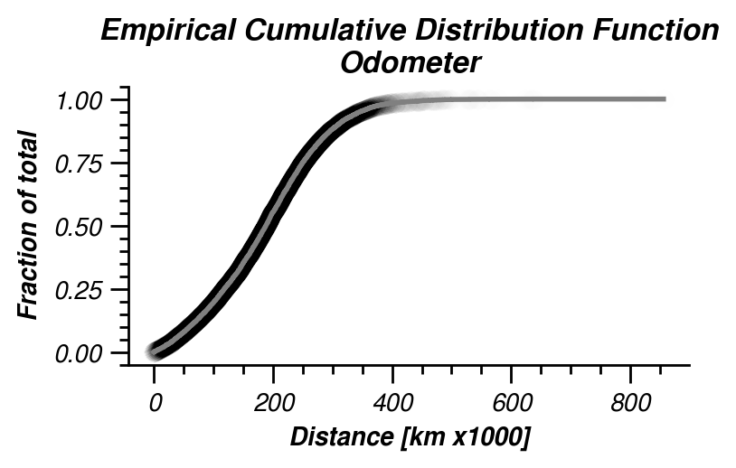
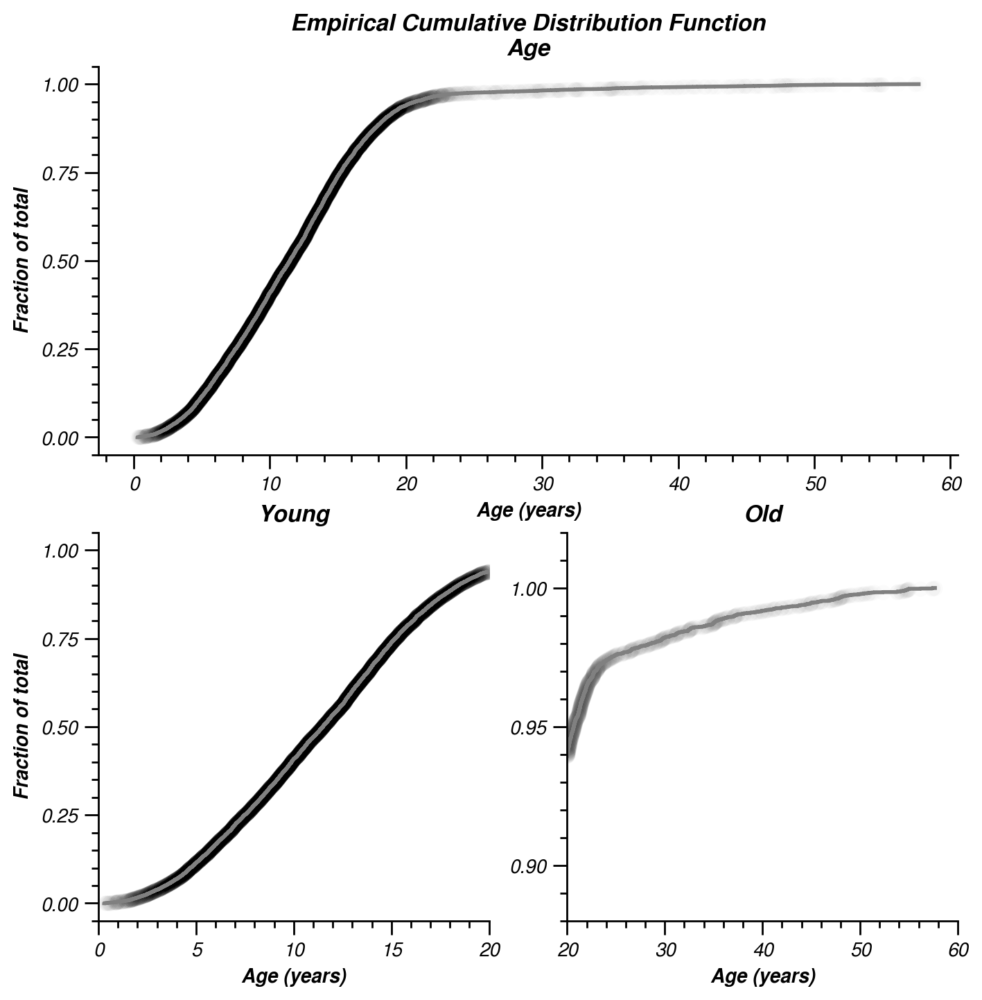

# Results

## Price

In auctions where the bid price is not made public the winning bid could have been outbid by only small difference. A common strategy is to **avoid round bids** (e.g. _EUR 100_). For instance an intended bid of _EUR 4200_ can be submitted as _EUR 4201_. With the extra euro you buy yourself the edge of outbidding the other bidder! However other bidders could do the same.  
In attempt to see where the balance is between outbidding and adding a little to your intended bid, I've investigated the last two digits of the prices in the auctions. Because only the winning bid is made public The distribution of all bids is unknown and strategic bidding prices remain invisible. But this analysis might give an indication of where to put a bid strategically.

  
_Figure 1. Last two digits of all winning bids (Feb. 2019). The last digits (0, 1, .. 8, 9) are on the abscissa. The decimal digits (10, 20, .. 80, 90) are on the ordinate. The lower left square contain bids ending with `00` (E.g. `1100`, `100` or `4200`). The upper right are bids ending with `99` (`4299`, `99`, ..). The number of bids are shown as color intensity. If the occurrence is homogenous for all numbers, the occurrence would be the total number of bids divided by the possibilities. As of February 2019 this was 2773/100 = 27.73 times. This is the (expected) average of occurrence and indicated in **white**. **Blue** indicates above average occurrence (saturating at 10 times the expected value) and **red** is below average (saturating at 1/10 of the expected value). Five most occurring digits (267 to 69 times) and five least occurring digits (only 2 to 4 times) are labeled inside the squares._

Fig. 1 shows bids ending with `00` are most frequent. A higher bid ending with `01` could have outbid these items. Other frequent occurring bids (blue) end with `11`, `50`, `55` and `77`. Figure 1 appear to show a blue-to-white diagonal (`x = y`). This indicates that bids with the same digits (`11`, `22`, `33`, ..) appear to be frequent. Bids with `4` as the last digit are not so frequent. This can be seen by a red vertical band at `x = 4`. Bids ending with `92` and `94` occur only twice each (dark red). It might be a good strategical advantage to use a bid ending with these values (however note the caveat not knowing all bids to this conclusion here above). Increasing a bid with close to EUR 100 might not be worth the edge, however a less expensive cost is to choose to end a bid with `37`, which only occurs 3 times.

## Usage

The intensity of usage determines the value of a car. Usage can be expressed as age and/or as distance travelled.

  
_Figure 2. Distribution of odometer reading expressed as cumulative density function (empirical cdf, ecdf). An ecdf is constructed by sorting values from small to large and at every value the graph is increased with `1/n`, with `n` being the number of data points. The resulting graph reflects the fraction of data `y` that is smaller than value `x`. Individual data points underlay the gray ecdf. Overlapping data points appear darker and are an extra visual aid indicating steepness of the ecdf. Note that distance is expressed as units of 1000 km (10^6m, Mm)._

Fig. 2 show the distribution of all odometer readings. These readings vary from 0 to >800,000 km. The median (`y = 0.5`) is around 180,000 km. The distribution appears to be approximately linear, thus uniformly distributed. This is also visible as the uniform gray shade in the data points.

  
_Figure 3. Distribution of age of cars (ecdf, see caption fig 2. for explanation). Top panel show the full distribution. The lower panels show the same data, but separated in two panels at 20 years (left: young cars, <20 year, right: old cars, >20 year). Note the different scale of the lower-right panel._

The distribution of car age is shown in figure 3. The top panel shows a long tail of cars at age >20 year. These are also shown in the lower-right panel. The lower-left panel zooms in on cars younger than 20 year. The distribution appears uniform (linearly increasing ecdf), but with some increased density at 5 and 15 year old cars.

Cars of comparable age can have different level of usage. To account for age the odometer can be expressed as function of age. 

  
_Figure 4. Distribution of usage per unit of time. Note that x-axis is in log-units. Top: ecdf (see caption fig. 2), Bottom: histogram. The median usage per day is indicated in blue._

Figure 4 shows that the usage per unit time appears to be log-normally distributed. Cars with lower than median usage are <45km/day and can go as low as a few km/day on average. High intensity usage can go beyond 100 km/day. Note that a brand new car (1 day old) with a 150 km reading falls in one of the extreme usage bins.

  
_Figure 5. Regression of age and odometer reading. Every dot is a car with a certain age and odometer reading. The lower left are young cars with low odometer readings. The upper-right are older cars with high odometer readings._

Fig 5. shows that age and odometer reading correlates. This is not unexpected. Interesting is the slope of the correlation and indicates the usage per unit of time as shown in figure 4.  