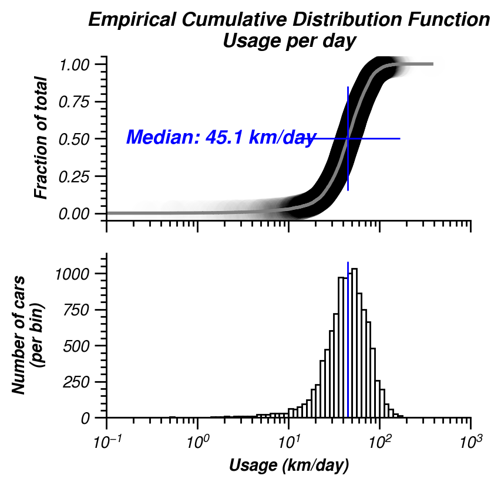
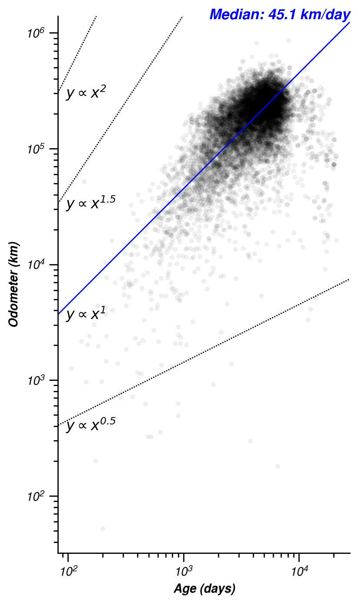
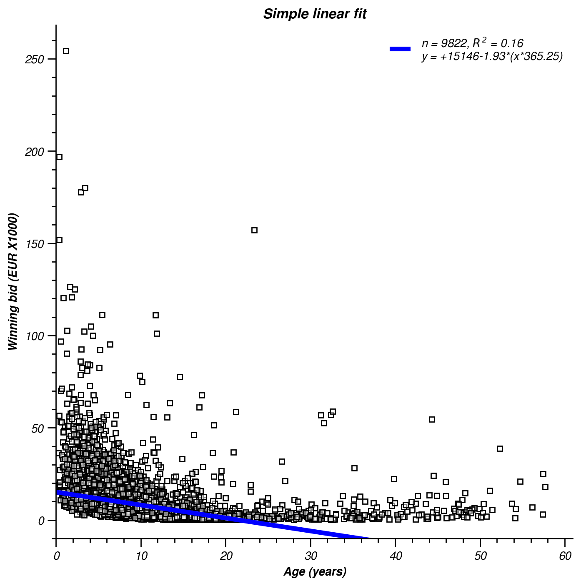

# Results

## Price

In auctions where the bid price is not made public the winning bid could have been outbid by only small difference. A common strategy is to **avoid round bids** (e.g. _EUR 100_). For instance an intended bid of _EUR 4200_ can be submitted as _EUR 4201_. With the extra euro you buy yourself the edge of outbidding the other bidder! However other bidders could do the same.  
In attempt to see where the balance is between outbidding and adding a little to your intended bid, I've investigated the last two digits of the prices in the auctions. Because only the winning bid is made public, the distribution of all the bids is unknown and strategic bidding prices remain invisible. But still this analysis might give an indication of where to strategically put a bid.

  
_Figure 1. Last two digits of all winning bids (Mar. 2019). The last digits (0, 1, .. 8, 9) are on the abscissa. The decimal digits (10, 20, .. 80, 90) are on the ordinate. The lower left square contain bids ending with `00` (E.g. `1100`, `100` or `4200`). The upper right are bids ending with `99` (`4299`, `99`, ..). The number of bids are shown as color intensity. If the occurrence is homogenous for all numbers, the occurrence would be the total number of bids divided by the possibilities. As of March 2019 this was 2891/100 = 28.91 times. This is the (expected) average of occurrence and indicated in **white**. **Blue** indicates above average occurrence (saturating at 10 times the expected value) and **red** is below average (saturating at 1/10 of the expected value). Five most occurring digit pairs (279 [`00`] to 72 times) and five least occurring digit pairs (only 2 to 4 times) are labeled inside the colored squares._

Fig. 1 shows bids ending with `00` are most frequent. A higher bid ending with `01` could have outbid these items. Other frequent occurring bids (blue) end with `11`, `50`, `55` and `77`. Figure 1 appear to show a blue-to-white diagonal (`x = y`). This indicates that bids with the same digits (`11`, `22`, `33`, ..) appear to be frequent. Bids with `4` as the last digit are not so frequent. This can be seen by a red vertical band at `x = 4`. Bids ending with `92` and `94` occur only twice each (dark red). It might be a good strategical advantage to use a bid ending with these values (however note the caveat not knowing all bids to this conclusion here above). Increasing a bid with close to EUR 100 might not be worth the edge, however a less expensive cost is to choose to end a bid with `37`, which only occurs 3 times.

## Usage

The intensity of usage determines the value of a car. Usage can be expressed as age and/or as distance travelled.

  
_Figure 2. Distribution of odometer reading expressed as cumulative density function (empirical cdf, ecdf) (Mar. 2019). An ecdf is constructed by sorting values from small to large and at every value the graph is increased with `1/n`, with `n` being the number of data points. The resulting graph reflects the fraction of data `y` that is smaller than value `x`. Individual data points underlay the gray ecdf. Overlapping data points appear darker and are an extra visual aid indicating steepness of the ecdf. Note that distance is expressed as units of 1000 km (10^6m, Mm)._

Fig. 2 show the distribution of all odometer readings. These readings vary from 0 to >800,000 km. The median (`y = 0.5`) is around 180,000 km. The distribution appears to be approximately linear, thus uniformly distributed. This is also visible as the uniform gray shade in the data points.

  
_Figure 3. Distribution of age of cars (ecdf, see caption fig 2. for explanation) (Mar. 2019). Top panel show the full distribution. The lower panels show the same data, but separated in two panels at 20 years (left: young cars, <20 year, right: old cars, >20 year). Note the different scale of the lower-right panel._

The distribution of car age is shown in figure 3. The top panel shows a long tail of cars at age >20 year. These are also shown in the lower-right panel. The lower-left panel zooms in on cars younger than 20 year. The distribution appears uniform (linearly increasing ecdf), but with some increased density at 5 and 15 year old cars.

Cars of comparable age can have different level of usage. To account for age the odometer can be expressed as function of age. 

  
_Figure 4. Distribution of usage per unit of time. Note that x-axis is in log-units (Mar. 2019). Top: ecdf (see caption fig. 2), Bottom: histogram. The median usage per day is indicated in blue._

Figure 4 shows that the usage per unit time appears to be log-normally distributed. Cars with lower than median usage are <45km/day and can go as low as a few km/day on average. High intensity usage can go beyond 100 km/day. Note that a brand new car (1 day old) with a 150 km reading falls in one of the extreme usage bins.

  
_Figure 5. Regression of age and odometer reading (Mar. 2019). Every dot is a car with a certain age and odometer reading. The lower left are young cars with low odometer readings. The upper-right are older cars with high odometer readings. The average (see fig. 4) use is indicated as a blue line. Lower and higher intensity usage (20, 40, 80 and 160 km/day), are indicated as dotted lines._

Fig 5. shows that age and odometer reading correlates. This is not unexpected. The slope of the correlation indicates the usage per unit of time. The average use is not a perfect prediction of the usage of all cars. Some old cars (>10,000 days) have an usage intensity below 10km/day. It also appears the data curves upwards. Meaning young cars have relative low intensity usage (>40 km/day) and older cars (~5000 days or ~15 year) have usage intensities well beyond 40 km/day.

Figure 6 shows the same data on a log-log axis. This enables a better view on other than linear correlation and whether the relation is according to a [power law](https://en.wikipedia.org/wiki/Power_law).

  
_Figure 6. Usage intensity. Same data as figure 5 on a log-log scaled axis (Mar. 2019). Here the dotted lines are usage intensity proportional increasing or decreasing with age. The blue line indicates intensity of usage that remains the same across all ages. Dotted lines above this average usage indicate an increase in intensity with age, and below the blue line a decrease of usage intensity._

Although the data seem to follow the average usage well, young cars appear to have lower intensity usages as most data fall below the blue line. It appears the data follows a steeper relation than linear (blue), indicating an exponential increase of usage with car age. A power of 1.5 seem to approximately match the data.  
Intuitively one would asume that usage intensity would go down with car age, thus a exponential decay (shrinkage) associated with a power smaller than one (e.g. `y = x^0.5` in fig. 6). In general this is not the case, but there is a clear subset of old cars (~10,000 days or ~30 years) where usage intensity is below average and drops exponentially.  

Another observation can be made in both figures 5 and 6. A subset of high intensity usage of cars are visible slightly below 200,000 km and ages ~1000-2000 days (~3-5 years). The intensity of usage is markedly higher than average with ~100 km/day. This is possibly the result of a business policy. Lease or rental companies might choose to renew their fleet when cars have odometers around 200,000 km. The car purpose (company cars) might explain the high intensity usage.

In conclusion, the average usage (~45 km/day) might not be the best way to assess other than usual usage (and consequently value). It might be better to model usage with a higher order function.  
Another likely confound to the above analysis that diesel cars on average are used more intensely. This is part due to Dutch tax rules: compared to gas the fuel price is lower, but the fixed road tax is higher. The relation of value and usage intensity might be different for different types of fuels.  
Furthermore it might be best to treat subsets of cars differently. Older cars might be used for recreational purpose only, and the usage intensity might have an lesser effect on their value.

## Modeling

Overall age seems a decent predictor for car value. The first and simplest model performs a linear regression on age and price. Figure 7 shows there is a negative correlation between age and price: newer cars have higher winning bids than older cars. 

  
_Figure 7. Linear regression of age and price (Mar. 2019). Car's age is the independent variable (x-axis) and the winning bid is the dependent variable (y-axis). Cars with no auction results and no known age are not included._

The result of a simple linear regression model predicts a depreciation of EUR 1.40 a day (Mar. 2019). The predicted price at auction of a brand new car (0 days old) is EUR 12k. There are some obvious shortcomings of this model. For one, the coefficient of determination (R^2) is low. Less than 15% of the variance in the price is explained by this model. But maybe more serious is that the prediction for cars of 25 years and older will be negative! Bidding price are always more than zero euros and this model predicts values that are impossible in real-life. 

Not only because of its poor performance will this model be unsuitable to predict future auctions, it also fails to generalize for other data. Here all data is used to "train" the linear model. Generally it is considered bad practice to neglect _cross validation_. Better is to test model performance on data that the model has not seen yet. This requires to split data in train and test sets. This can be done multiple times and the variance in the model performance is an indication of how well a model generalizes over all possible data.

