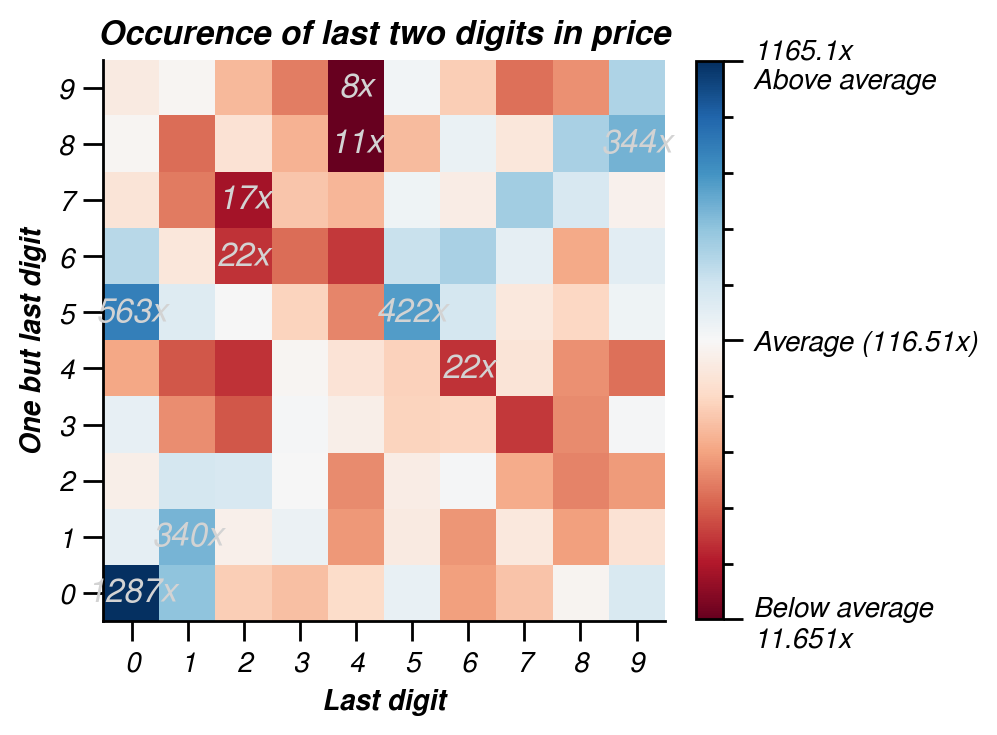

# Results

## Price

In auctions where the bid price is not made public the winning bid could have been outbid by only small difference. A common strategy is to **avoid round bids** (e.g. _EUR 100_). For instance an intended bid of _EUR 4200_ can be submitted as _EUR 4201_. With the extra euro you buy yourself the edge of outbidding the other bidder! However other bidders could do the same.  
In attempt to see where the balance is between outbidding and adding a little to your intended bid, I've investigated the last two digits of the prices in the auctions. Because only the winning bid is made public The distribution of all bids is unknown and strategic bidding prices remain invisible. But this analysis might give an indication of where to put a bid strategically.

  
_Figure 1. Last two digits of all winning bids (Feb. 2019). The last digits (0, 1, .. 8, 9) are on the abscissa. The decimal digits (10, 20, .. 80, 90) are on the ordinate. The lower left square contain bids ending with `00` (E.g. `1100`, `100` or `4200`). The upper right are bids ending with `99` (`4299`, `99`, ..). The number of bids are shown as color intensity. If the occurrence is homogenous for all numbers, the occurrence would be the total number of bids divided by the possibilities. As of February 2019 this was 2773/100 = 27.73 times. This is the (expected) average of occurrence and indicated in **white**. **Blue** indicates above average occurrence (saturating at 10 times the expected value) and **red** is below average (saturating at 1/10 of the expected value). Five most occurring digits (267 to 69 times) and five least occurring digits (only 2 to 4 times) are labeled inside the squares._

Fig. 1 shows bids ending with `00` are most frequent. A higher bid ending with `01` could have outbid these items. Other frequent occurring bids (blue) end with `11`, `50`, `55` and `77`. Figure 1 appear to show a blue-to-white diagonal (`x = y`). This indicates that bids with the same digits (`11`, `22`, `33`, ..) appear to be frequent. Bids with `4` as the last digit are not so frequent. This can be seen by a red vertical band at `x = 4`. Bids ending with `92` and `94` occur only twice each (dark red). It might be a good strategical advantage to use a bid ending with these values (however note the caveat not knowing all bids to this conclusion here above). Increasing a bid with close to EUR 100 might not be worth the edge, however a less expensive cost is to choose to end a bid with `37`, which only occurs 3 times.
