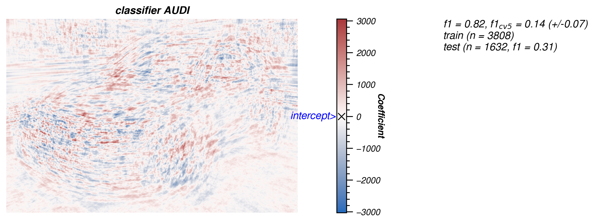
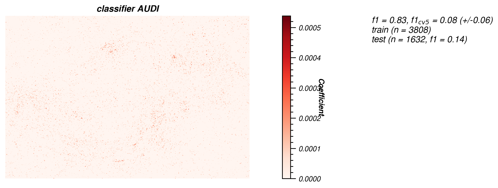
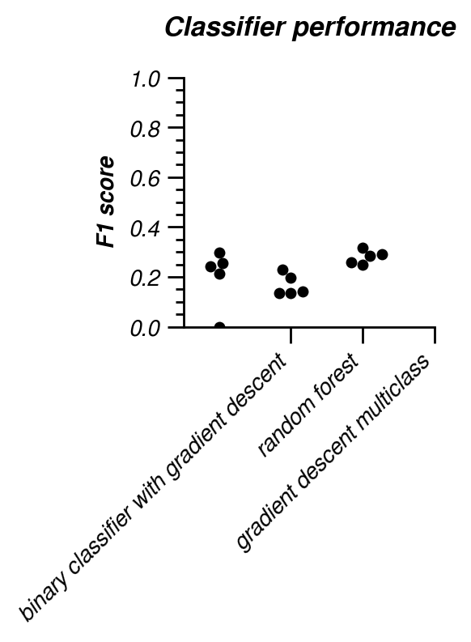

# Classify car brand

_Work in progress._

  
_Figure 1. High resolution representation of variance within images. All front view images (left-front facing) are overlapped and the variance is computed pixel-wise._

  
_Figure 2. High resolution representation of binary classifier with gradient descent._

  
_Figure 3. High resolution representation of random forest binary classifier._

  
_Figure 4. High resolution representation of multiclass classifier (with gradient descent)._

## Image preprocessing

_Figure 5. Example of how Detectron2 segments the car from the background._

- - - -
## Model performance

As a measure of performance I use _F1 scores_. F1 is defined as:

$F1 = 2*\frac{recall * specificity}{recall + specificity}$ with  
$recall = \frac{n_{tp}}{n_{cp}}$  
$specificity = \frac{n_{tn}}{n_{cn}}$ and  
`n`: number (count)  
`tp`: true positive  
`tn`: true negative  
`cp`: condition positive  
`cn`: condition negative  

It takes into account that a good model is able to be precise (**specificity**: not including too many false positives) and able to retrieve all positive elements (**recall**: identify as many as the true positives).

  
_F1 scores as measure of classification performance for all models._