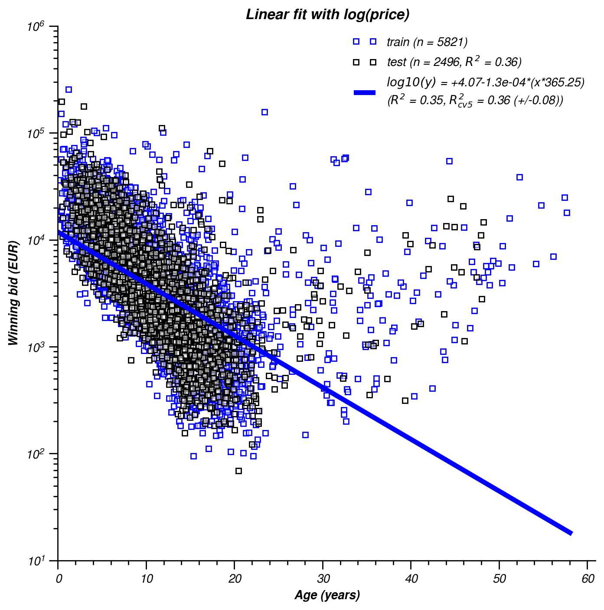
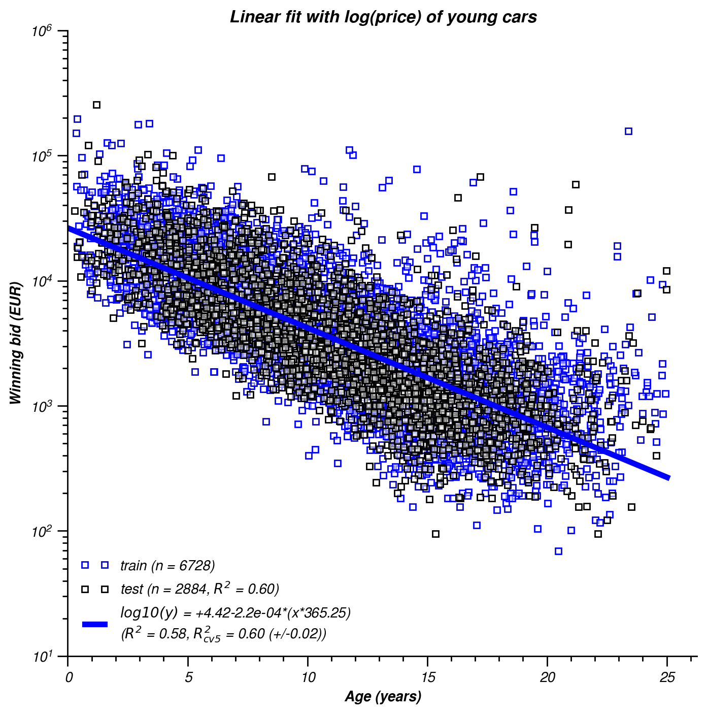
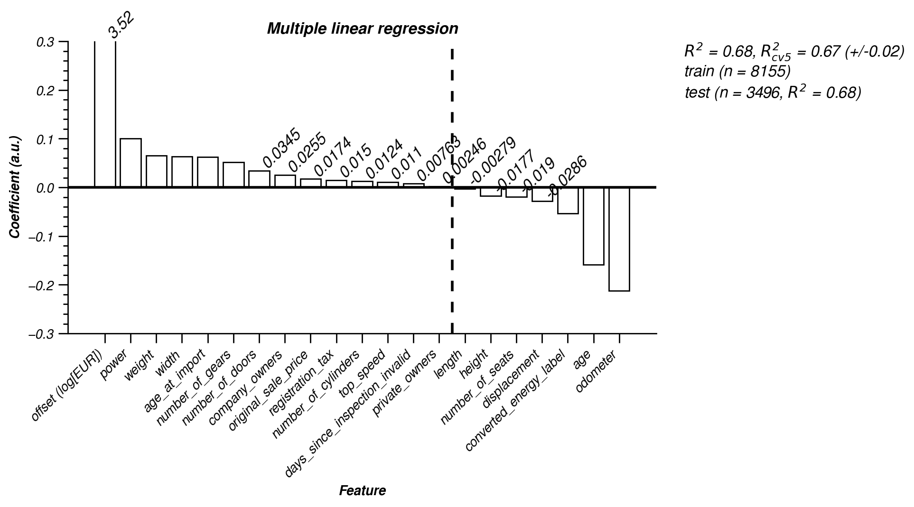
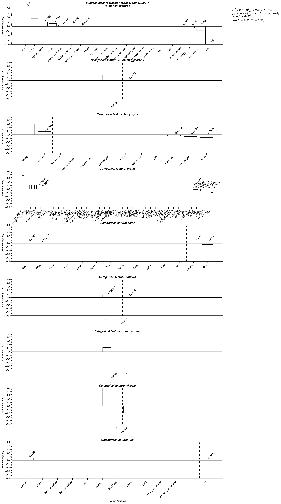
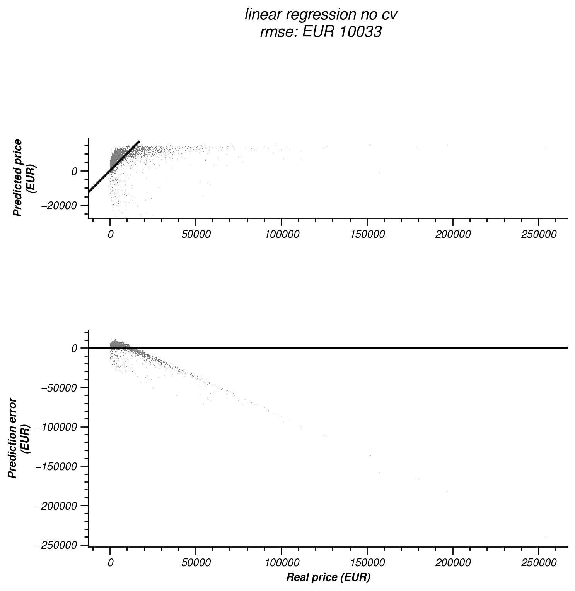
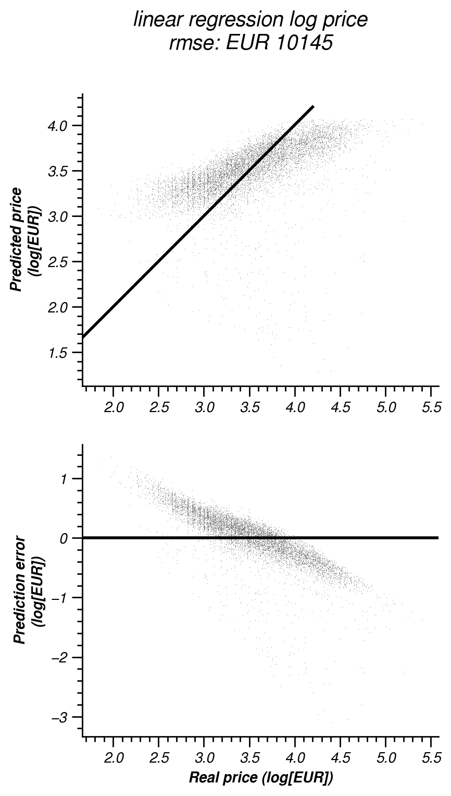
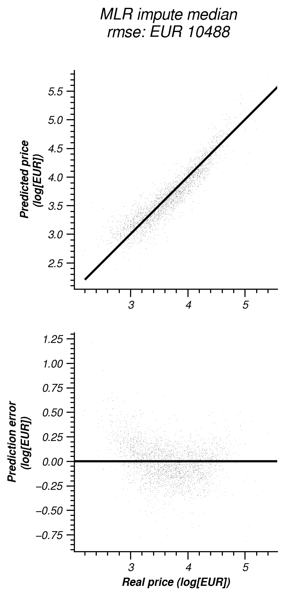
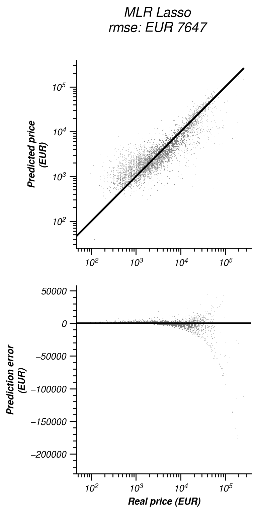
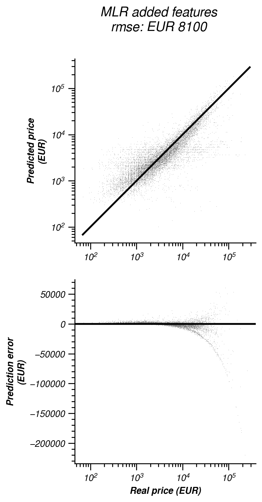
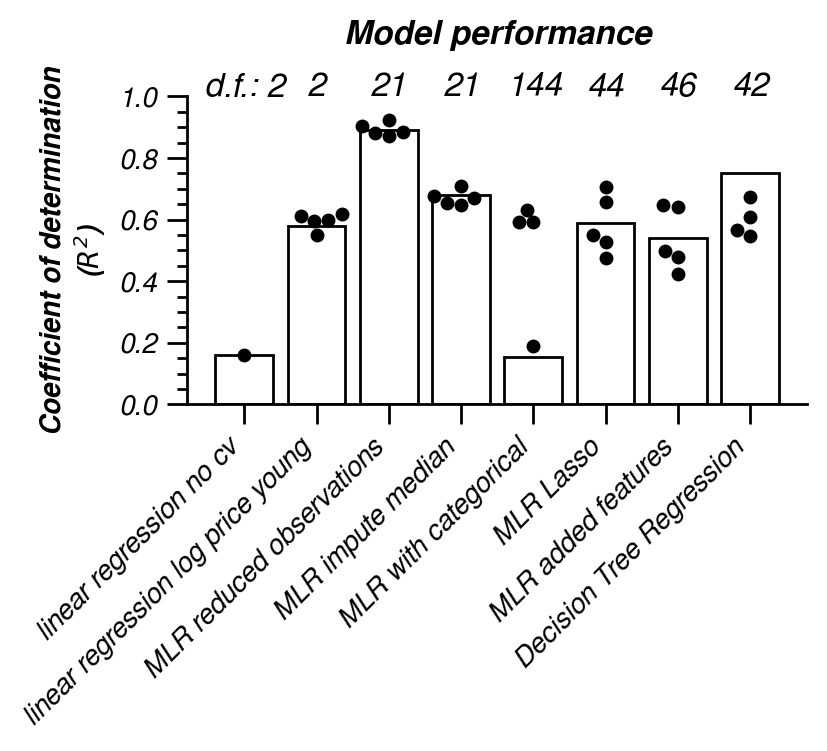

# Predicting winning bids with regression models

Overall age seems a decent predictor for car value. The first and simplest model performs a linear regression on age and price. Figure 1 shows there is a negative correlation between age and price: newer cars have higher winning bids than older cars. 

  
_Figure 1. Linear regression of age and price. Car's age is the independent variable (x-axis) and the winning bid is the dependent variable (y-axis). Cars with no auction results and no known age are not included. The resulting fit is shown in the legend. Note that for graphical purposes the x-scale is converted to year, where the source data has unit days._

The result of a simple linear regression model predicts a depreciation of EUR 1.6 a day (May 2022). The predicted price at auction of a brand new car (0 days old) is EUR 13k. There are some obvious shortcomings of this model. For one, the coefficient of determination ($R^2$) is low. Less than 15% of the variance in the price is explained by this model. But maybe more serious is that the prediction for cars of 25 years and older will be negative! Bidding price are always more than zero euros and this model predicts values that are impossible in real-life. 

Not only because of its poor performance will this model be unsuitable to predict future auctions, it also fails to generalize for other data. Here all data is used to "train" the linear model. Generally it is considered bad practice to neglect _cross validation_. Better is to test model performance on data that the model has not seen yet. This requires to split data in train and test sets. This can be done multiple times and the variance in the model performance is an indication of how well a model generalizes over all possible data. In subsequent model evaluations cross validation will be added.

As we've seen bidding price can not be negative and during e.d.a. winning bids are log-normally distributed. Improving on the linear model above would be to transform the prediction in **log units**. This matches the data better and predicted prices cannot go below zero. Figure 2 shows the result.

  
_Figure 2. As figure 1, but with log-transformed dependent variable (winning bid). Data used for fitting are marked as blue, the test set is marked black. $R^2$ is shown for fitting test data, all data and the mean and standard deviation of cross validations (cvX, where X denotes number of folds)._

The fit show that new cars start with ~$10^4$ euro and depreciate daily with ~$10^{-4}$ (0.01 ct). The latter means the model predicts that cars depreciate to half their value every 7.1 years (eq. 1, May 2019). Note that this is what this model predicts. In reality the depreciation is much steeper. We will see this below when we ignore classic cars. 

$$\frac{\log(2)}{-\beta_1 \cdot \log(10)}$$ (eq. 1),

where $\beta_1$ is the last parameter of the fitted function (May 2019: $\beta_1 = 1.2 \cdot 10^{-4}$).

The performance of this model has improved. ~30% of the variance can be explained. Although the test set yields equal performance, cross validation shows that the generalization of this model isn't very good (standard deviation of $R^2$ in 5 folds is 0.12).

However we need to exercise some caution interpreting the performance, because the prediction error is calculated in log[EUR]. This caution holds for the following models as well. When I introduce a model with categorical features, the performance is calculated after inverse transformation.

There is still room for improvement here. Cars older than 20 year seem to have a strong effect on the fit result. As already concluded earlier, these classic cars might need separate treatment.

  
_Figure 3. as figure 2, but ignoring older cars by focussing on cars younger than 25 years._

Figure 3 shows the result of a fit with partial data. This model predicts a steeper depreciation. Every 3.7 years (May 2022) the predicted bids are divided by two and new cars are EUR 23k (at day 0 the price is $10^{4.36}$, May 2022). The performance of this model is reasonable with $R^2 = 0.6$, also cv shows the model generalizes well (std. dev < 0.1).

Note that this model only uses age to predict. This is **only one feature**. The model can be improved by adding more information about, or features of, the car. 

## Multiple linear regression (MLR)

Figure 4 shows the result of MLR. As with the previous model, the predicted bid is in log units, but all ages are used. 19 features are included and the model allows for an fixed offset (bias). If a value is missing from one of the features the car is removed. This causes a **reduction of the data set**.

  
_Figure 4. Result of Multiple Linear Regression (MLR). Bar height indicate coefficient of the features. When the bar height is small a value is shown. The first bar indicates the offset. Subsequent features are sorted in descending order. The dashed line separates features with positive coefficient from features that have a negative coefficient. This indicates which features correlate positively or negatively._

The accuracy of the MLR model is around 0.9 and it generalizes well. However in general the coefficients are very low. The sign of the coefficients indicates what features have a positive or negative influence on the bidding price. This corroborates the observations during e.d.a..

However, a keen observer already spotted that the number of cars that are used for this model has dramatically reduced. Where the first (single linear) regression uses several thousand cars in total, here in the MLR it is a lot less (~1500, May 2022). This is because cars with a missing value are dropped from the analyses. For instance when the `weight` is not registered, the car is dropped. This becomes a serious issue when the model uses a large number of features. The chances of needing to drop an observation because of a missing field increases.  
To overcome this, the missing values can be substituted by an _"assigned value"_. This proces is know as _'imputation'_. Common strategies are to impute with zero, or the mean or median of the other observations.

The resulting coefficients are expressed in units of the feature. For example the number of doors (e.g. coefficient $\beta = -0.03$) contributes to the prediction (in log[EUR]) with 0.03 doors/log(EUR). As a result coefficients depend on their scale and scales are different for different features. The number of doors are less than number of kilometers per hour at max speed. To overcome this all features can be scaled to similar ranges. 

In figure 5 missing values are imputed with median values. Also all features are scaled according to equation 2. This is know as **normalizing**, z-scoring or z-transforming.

$$z = \frac{x - \mu} {\sigma}$$ (eq. 2),

where $z$ is the normalized value of input value $x$, and $\mu$ and $\sigma$ the mean and standard deviation of $x$.

  
_Figure 5. As fig. 4; Result of Multiple Linear Regression (MLR) but with missing values replaced with median value and with features normalized._

The models accuracy has changed dramatically ($R^2 = ~0.7$), but note that the original number of observations (~8000, May 2022) has been restored. 

There is one car where prediction and real bid are quite different (see model 5 accuracy here below in section "How are we doing?"). The real bid is ~3.2 log (EUR ~1600), but the predicted bid is ~1.9 log (EUR ~80). This particular lot (2017-3-8109) is a 2005 Mercedes e200 with an odometer reading of 816k km! Querying the web with the registration number confirms this car indeed has a very high odometer reading. If the MLR model penalizes heavily for odometer reading, the prediction can be a lot lower than the actual value. A linear scaling as performed according to eq. 2 might not be the best solution.

A confound of these kind of MLR models is that they do not handle co-linearity well. For instance we saw that _odometer reading_ and _age_ are highly correlated (fig. 5 and 6). As a consequence of correlation coefficients could outweigh each other, leading to uninterpretable coefficients.

Another reason that could hold performance back in this model is that there are not a lot of features, and the complexity of the model is relatively low. The following model adds more features by **adding categorical features**. These features do not have a numerical value but non-ordinal discrete values such as color. These features however could still be important determinants of the auction value, with car brand being the obvious one.

  
_Figure 6. As fig. 4; Result of Multiple Linear Regression (MLR) with numerical and categorical features. The top panel shows the numerical features as used in the previous model (fig. 5). The panels below the top panel are the categorical features. As with the numerical features the coefficients are sorted as well. The third panel show that luxury brands like "Rolls-Royce" are left of the vertical dashed line and positive contributors to the auction price._

The categorical features are transformed to a numerical feature by employing a "one-hot-encoding" method. In essence a single field is split in different fields as many as there are possible values and for every observation the field gets a value of 1 and otherwise zero. E.g. in a particular observation the field _brand = 'BMW'_. The newly one-hot-encoded fields are 'brand audi', 'brand bmw', 'brand citroen' which will get values 0, 1, 0 receptively.

As with the previous MLR model the missing numerical values are replaced with the median value. In the categorical features the category "missing" is introduced.

Figure 6 shows the contributions of the category values to the auction price. Values left of the dashed line have a positive coefficient and contribute positively to the price. The higher the bar, the larger the contribution. The current model predicts that the brand name contribute more to the price than the power. Compare the coefficients for _Rolls-Royce > +1_ and _power < +1_ in the top and third panel (Although note the scale differences). It also shows that four wheel drive (fwd) is not a good predictor in this model. 

Unfortunately this model does not generalize well. CV $R^2$ is very variable. Also there is no real improvement in accuracy with $R^2 = ~0.6$. However the model does the logarithmic target transformation (fig. 2) internally and computes $R^2$ on the real price in EUR and the early warning does not hold here.

By adding categorical features there is a risk of overfitting. A way to overcome this is by applying regularization to constrict the coefficients from becoming large. The Lasso regularization method is commonly applied to achieve this.

  
_Figure 7. As fig. 6; MLR with categorical and numerical features, but with regularization (Lasso). The dashed lines bound coefficients that are zero._

The effect of regularization can be seen in figure 7. Overall, coefficients are reduced (note scale differences between figure 6 and 7) and many are set to zero. The regularization hyperparameter alpha was determined by a grid search and set to $\alpha = ~0.001$ and about 2/3 of the coefficients are suppressed to zero. The performance of the model is comparable to the model without regularization (see fig. 6), but this model uses less features (i.e. it is less complex) to achieve this. The overal trend of feature importance is maintained. The brand feature might be more insightful now than in the un-regularized model.  

As said the Lasso model performs equivalently to the non regularized model (fig. 2) with $R^2 = ~0.6$ and with similar high variable CV $R^2$, indicating low level of generalization.

_WORK IN PROGRESS_: This model has added features.

  
_Figure 8. As fig. 7; Lasso regularized MLR with added features._

- - - - 
# How are we doing?

Here is a summary of the performance of the models described above.

| Model 1 | Model 2 | Model 3 | Model 4 | Model 5 | Model 6 | Model 7 | Model 8 |
|:-------:|:-------:|:-------:|:-------:|:-------:|:-------:|:-------:|:-------:|
|  |  |  |  |  |  |  |  |  

_Model performance. Regression of data and prediction are shown in the top panels. The residuals (errors) are in the bottom panels. The solid lines indicate perfect predictions. Note that errors are shown as function of real bidding prices. This visualizes systematic under- or over estimation._

  
_R-square of all models. With every new model the aim is to improve the accuracy of the prediction, thus increasing $R^2$._

